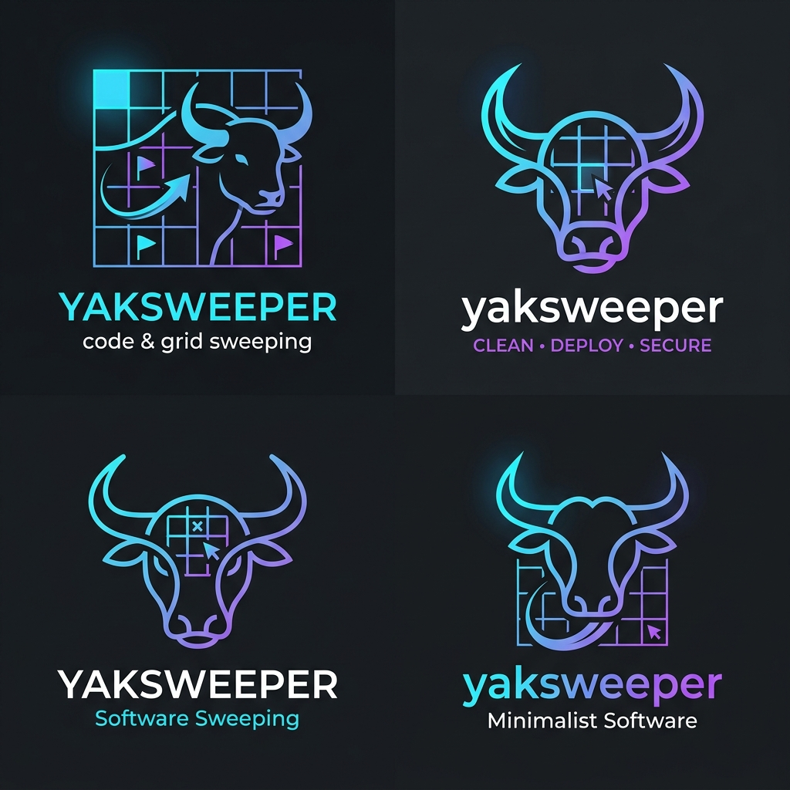

<div align="center">
  
  <h1>Yaksweeper</h1>
  <p><em>A modern Minesweeper implementation for Emacs using Unicode visuals and transient menus.</em></p>
</div>

---

## 💣 Overview

**Yaksweeper** brings the classic Minesweeper experience straight to your favorite editor, Emacs! It features a beautiful Unicode-based grid, varying difficulty levels, statistical tracking, and an intuitive [Transient](https://magit.vc/manual/transient/) interface.

## ✨ Features

- **Transient Menus**: Launch and configure games easily with `M-x yaksweeper`.
- **Unicode Graphics**: Clean visual indicators using emojis (⬜, ⬛, 🚩, 💣, 💥, ❌).
- **Multiple Difficulties**: 
  - Beginner (9x9, 10 mines)
  - Intermediate (16x16, 40 mines)
  - Expert (30x16, 99 mines)
- **Custom Games & Presets**: Start any valid board size and mine count, optionally saving it for later.
- **Safe First Reveal**: Your first guess never hits a mine.
- **Informational Assists**: See flagged mines, remaining safe cells, over-flag warnings, and wrong flags after a loss.
- **Visible Selection & Controls**: Keyboard selection is highlighted, with controls shown in the game buffer.
- **Statistics Tracking**: View overall results, per-board summaries, best times, averages, and recent history.
- **Mouse & Keyboard Support**: Full support for standard keybindings and mouse chords.

## 📦 Requirements

- GNU Emacs **30.1** or newer
- **transient** 0.3.7 or newer

## 🚀 Usage

Start the game with:
```elisp
M-x yaksweeper
```

From the Transient menu:

| Key | Action |
|-----|--------|
| `b` | Start Beginner (9x9, 10 mines) |
| `i` | Start Intermediate (16x16, 40 mines) |
| `e` | Start Expert (30x16, 99 mines) |
| `c` | Start a custom game (`yaksweeper-custom`) |
| `p` | Start a saved preset (`yaksweeper-start-preset`) |
| `s` | Show statistics (`yaksweeper-show-stats`) |

`M-x yaksweeper-custom` prompts for width, height, mine count, and an optional preset name. Saved presets are available across sessions through `M-x yaksweeper-start-preset`.

### Keybindings

When in `yaksweeper-mode`, use the following controls:

| Action | Keyboard | Mouse |
|--------|----------|-------|
| **Move Selection** | Arrow keys or `h`, `j`, `k`, `l` | - |
| **Reveal Cell** | `RET`, `SPC`, or `x` | `mouse-1` (Left Click) |
| **Flag/Unflag** | `f` or `m` | `mouse-3` (Right Click) |
| **Chord** (Reveal neighbors) | `c` | `mouse-2` (Middle Click) or `double-mouse-1` |
| **Restart Game** | `r` | - |

> *Tip: Chording on a revealed number that has the correct amount of flagged neighbors will automatically reveal the rest of its neighbors.*

## 📈 Statistics

Yaksweeper tracks wins, losses, completion times, board dimensions, mine counts, and preset names using Emacs' `multisession` variables.
View your stats from the main menu by pressing `s` (`yaksweeper-show-stats`).

The stats buffer shows:

- Overall games, wins, losses, and win rate.
- Per-board summaries with games, win rate, best win time, and average win time.
- Recent game history, newest first.

Older stat records are still supported; they display using their saved difficulty names.

## 🧭 Board Header

The game header shows `Mines: flagged/total`, `Remaining: N`, and elapsed time. `Remaining` is the number of unrevealed safe cells, or `width*height - mines` before the first reveal.
If you place more flags than the mine count, the mine counter is highlighted as a warning without changing gameplay rules. After a loss, incorrectly flagged non-mine cells display with the wrong-flag marker.

## 🛠️ Customization

You can customize the appearance of Yaksweeper via the `yaksweeper` customization group:
```elisp
M-x customize-group RET yaksweeper RET
```
Available options include changing the characters used for mines, flags, hidden cells, wrong flags, the board cell width, and the colors (faces) of numbers and warnings. Board cells use fixed alignment stops, and selection uses Emacs' cursor instead of styling board glyphs, which keeps the grid text stable while you move and reveal cells.

Custom board sizes are capped by `yaksweeper-max-width`, `yaksweeper-max-height`, and `yaksweeper-max-cells` to avoid accidentally creating a board large enough to hang Emacs. Raise those values through the customization group if you intentionally want larger games.

## 🧪 Development

Run the project checks with:
```sh
make check
```

This byte-compiles `yaksweeper.el` with warnings as errors, runs Checkdoc, and executes the ERT suite.

## 📄 License

Yaksweeper is released under the MIT License. See [LICENSE](LICENSE).
